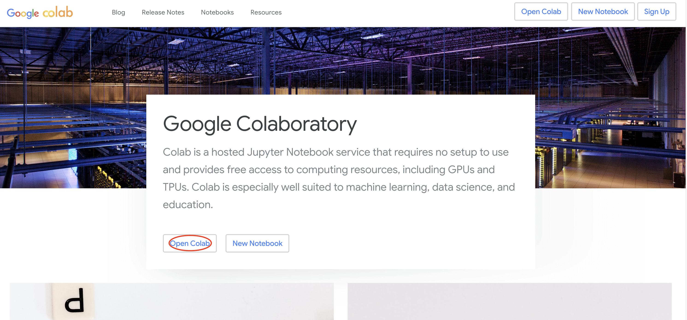
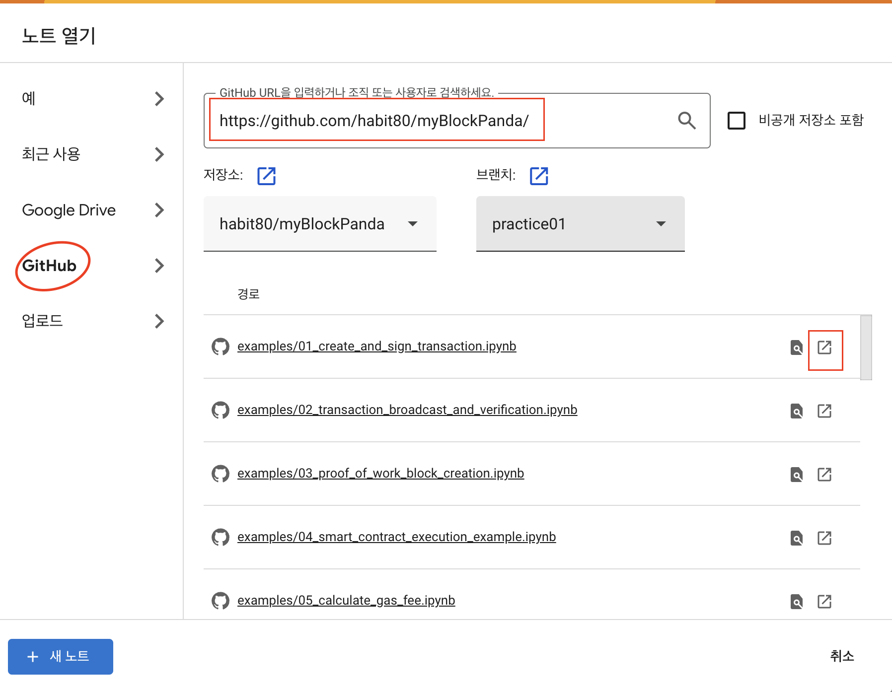

# 블록체인 기술 구현 실습

## 예제 리스트

### 간단한 블록체인 네트워크 구축
   | **파일명**                                    | **설명**                                              |
   |----------------------------------------------|-------------------------------------------------------|
   | [`01_create_and_sign_transaction.ipynb`](examples/01_create_and_sign_transaction.ipynb)           | 트랜잭션 생성과 서명 예제.                             |
   | [`02_transaction_broadcast_and_verification.ipynb`](examples/02_transaction_broadcast_and_verification.ipynb)| 트랜잭션 전파 및 검증 과정 시뮬레이션.                 |
   | [`03_proof_of_work_block_creation.ipynb`](examples/03_proof_of_work_block_creation.ipynb)          | PoW(작업 증명) 블록 생성 과정 구현.                   |
   | [`04_smart_contract_execution_example.ipynb`](examples/04_smart_contract_execution_example.ipynb)      | 스마트 컨트랙트 실행 간단 예제.                        |
   | [`05_calculate_gas_fee.ipynb`](examples/05_calculate_gas_fee.ipynb)                     | Gas Fee(가스 요금) 계산 예제.                         |
   | [`06_pos_validator_simulation.ipynb`](examples/06_pos_validator_simulation.ipynb)              | PoS(지분 증명) 검증자 역할 시뮬레이션.                 |
   | [`07_state_and_storage_management.ipynb`](examples/07_state_and_storage_management.ipynb)          | 이더리움 상태(State) 및 스토리지(Storage) 관리 예제.   |
   | [`08_merkle_patricia_trie_structure.ipynb`](examples/08_merkle_patricia_trie_structure.ipynb)        | Merkle Patricia Trie 구조 구현.                       |
   | [`09_dapp_simple_voting_system.ipynb`](examples/09_dapp_simple_voting_system.ipynb)             | DApp(탈중앙화 애플리케이션) 간단한 투표 시스템 예제.   |
   | [`10_blockchain_data_validation.ipynb`](examples/10_blockchain_data_validation.ipynb)            | 블록체인 데이터 검증 및 무결성 확인 구현.              |

### 암호화 기술 심화
   | **파일명**                                      | **설명**                                                  |
   |-------------------------------------------------|----------------------------------------------------------|
   | [`11_ecdsa_key_generation_and_signature.ipynb`](examples/11_ecdsa_key_generation_and_signature.ipynb)      | ECDSA를 사용한 키 생성, 서명 및 검증 과정 구현.             |
   | [`12_merkle_tree_creation_and_validation.ipynb`](examples/12_merkle_tree_creation_and_validation.ipynb)     | Python으로 Merkle Tree 생성 및 검증 실습.                  |
   | [`13_hashing_with_hashlib_and_cryptography.ipynb`](examples/13_hashing_with_hashlib_and_cryptography.ipynb)   | `hashlib` 및 `cryptography` 라이브러리를 활용한 해싱 구현.  |
   | [`14_transaction_signature_and_validation.ipynb`](examples/14_transaction_signature_and_validation.ipynb)    | 실제 트랜잭션 서명 및 검증 구현.

## Google Colab으로 예제 실행 방법

1. 구글 코랩 접속

    https://colab.google/

1. `Open Colab` 클릭

    

1. gitHub repository 주소를 입력하고, 올바른 브랜치 설정 후 주피터 노트북 파일 클릭

    