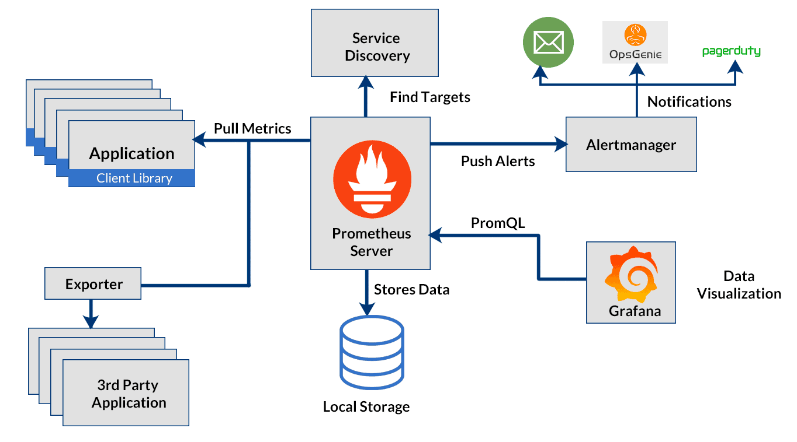
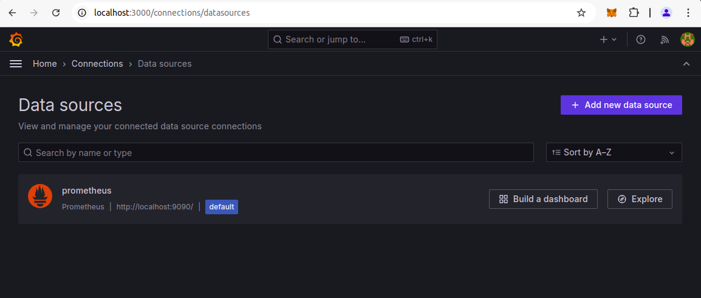
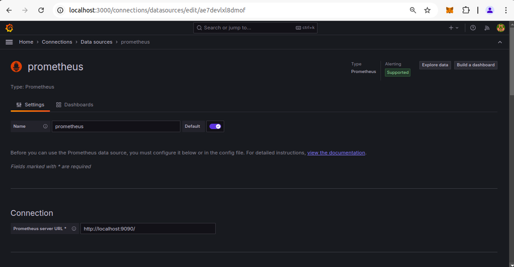
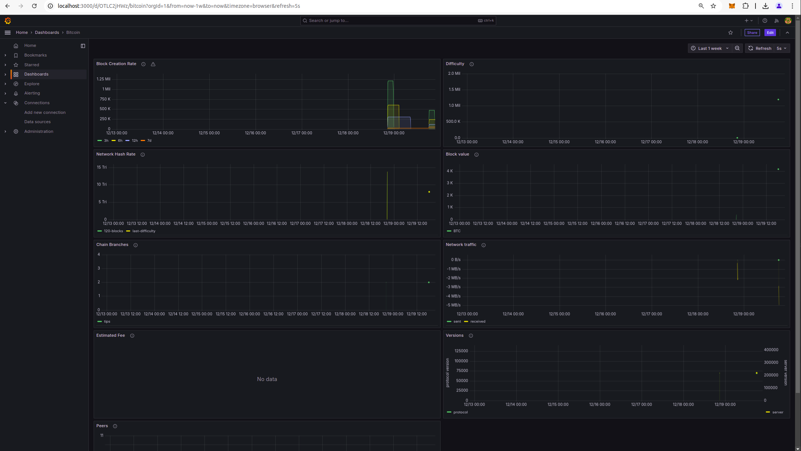

# Prometheus와 Grafana를 사용한 노드 모니터링

이 문서는 **Prometheus**, **bitcoin exporter** 와 **Grafana**를 사용하여 블록체인 노드의 상태를 모니터링하는 방법, 노드 로그 분석, 그리고 주요 성능 지표를 확인하는 과정을 설명



## **1. Prometheus로 노드 모니터링 설정**

### **Step 1: Prometheus 설치**
1. Prometheus의 공식 웹사이트에서 최신 버전을 다운로드: [Prometheus 다운로드](https://prometheus.io/download/).
1. 다운로드한 파일을 추출하고 Prometheus 바이너리를 실행:
   ```bash
   tar -xvzf prometheus*.tar.gz
   cd prometheus-*

   sudo mv prometheus /usr/local/bin/
   sudo mv promtool /usr/local/bin/

   sudo mkdir -p /etc/prometheus /var/lib/prometheus
   sudo mv consoles/ console_libraries/ prometheus.yml /etc/prometheus/

   ./prometheus --config.file=prometheus.yml
   ```
1. 접속 확인
- http://localhost:9090

### **Step 2: Prometheus 설치**
- `prometheus.yml` 파일을 수정하여 노드의 메트릭 데이터를 스크래핑하도록 설정
- bitcoin core 노드(JSON-RPC 활성화)의 예시:
    ```yaml
    scrape_configs:
    - job_name: 'bitcoind'
        static_configs:
        - targets: ['localhost:9332']
    ```

### **Step 3: Prometheus 설치**
- Bitcoin core 노드를 위한 bitcoin-exporter와 같은 메트릭 익스포터를 사용하거나, RPC 메트릭 데이터를 노출하는 Python 스크립트를 작성
- 예시:
    ```bash
    pip install prometheus_client web3
    ```


## **2. bitcoin exporter 실행**

- dd
    ```bash
    git clone https://github.com/jvstein/bitcoin-prometheus-exporter.git
    cd bitcoin-prometheus-exporter
    ```

- dd
    ```bash
    docker-compose build
    docker-compose up
    ```


## **3. Grafana를 사용한 시각화**

### **Step 1: Grafana 설치**
1. [Grafana 설치](https://grafana.com/docs/grafana/latest/setup-grafana/installation/debian/)
    ```bash
    sudo apt-get install -y apt-transport-https software-properties-common wget

    sudo mkdir -p /etc/apt/keyrings/
    wget -q -O - https://apt.grafana.com/gpg.key | gpg --dearmor | sudo tee /etc/apt/keyrings/grafana.gpg > /dev/null

    echo "deb [signed-by=/etc/apt/keyrings/grafana.gpg] https://apt.grafana.com stable main" | sudo tee -a /etc/apt/sources.list.d/grafana.list

    echo "deb [signed-by=/etc/apt/keyrings/grafana.gpg] https://apt.grafana.com beta main" | sudo tee -a /etc/apt/sources.list.d/grafana.list

    # Updates the list of available packages
    sudo apt-get update

    # Installs the latest OSS release:
    sudo apt-get install grafana
    ```
1. 설치 후 Grafana 서버를 실행
    ```bash
    sudo systemctl start grafana-server
    ```

### **Step 2: Grafana 설치**
1. Grafana 웹 인터페이스(기본 주소: http://localhost:3000)에 로그인
    - id : admin
    - pwd : admin
1. "Settings > Data Sources"로 이동하여 새 데이터 소스를 추가
    
1. Prometheus를 선택하고 Prometheus 서버 URL을 입력(예: http://localhost:9090)
    


### **Step 3: 대시보드 import**
1. 대시보드에서 dashboard file [bitcoin-grafana.json](../prometheus_and_grafana/bitcoin-grafana.json) 를 임포트 시키기
1. 주요 지표 예시:
    - 블록 생성 속도: `Block Creation Rate`
    - 채굴 난이도: `Difficulty`
    - 네트워크 해시율: `Network Hash Rate`
    - 예상 트랜잭션 수수료: `Estimated Fee`
        


## **3. 노드 로그 분석**

### **로그 파일 위치**

- Bitcoin Core:
    - 기본 로그 파일: `~/.bitcoin/debug.log`

- Ethereum (Geth):
    - 기본 로그 파일: `~/.ethereum/geth.log`


### **로그 분석 도구**

- **grep**을 사용해 특정 키워드 검색:

    ```bash
    grep "error" ~/.bitcoin/debug.log
    ```

- **Logrotate**를 사용해 로그 파일 크기 관리:
    - `/etc/logrotate.d/`에 설정 추가:
        ```lua
        /home/user/.bitcoin/debug.log {
        rotate 7
        daily
        compress
        missingok
        }
        ```

## **4. 주요 성능 지표**
1. 블록 높이(block height): 노드가 최신 블록에 동기화되었는지 확인.
1. 트랜잭션 풀 크기(txpool size): 처리 대기 중인 트랜잭션 개수.
1. CPU 및 메모리 사용량: 노드가 소비하는 리소스를 확인.