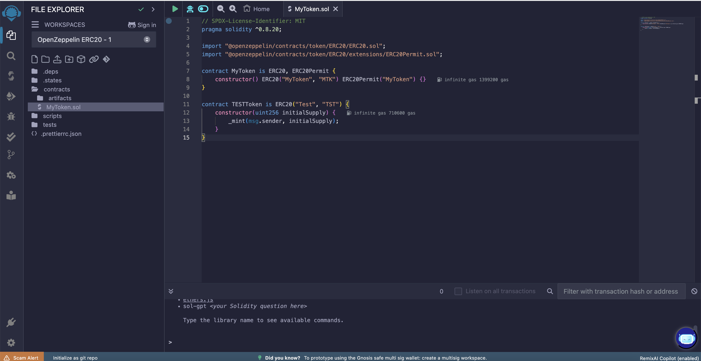
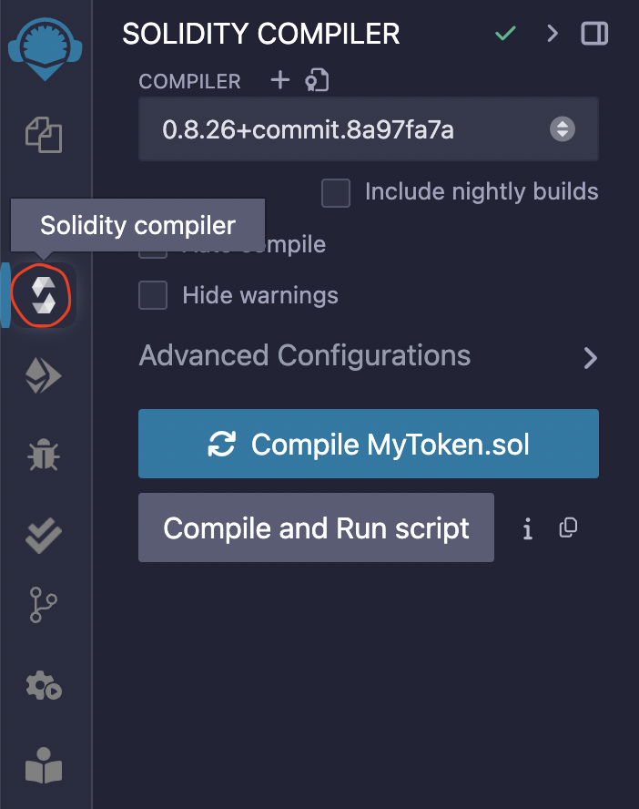
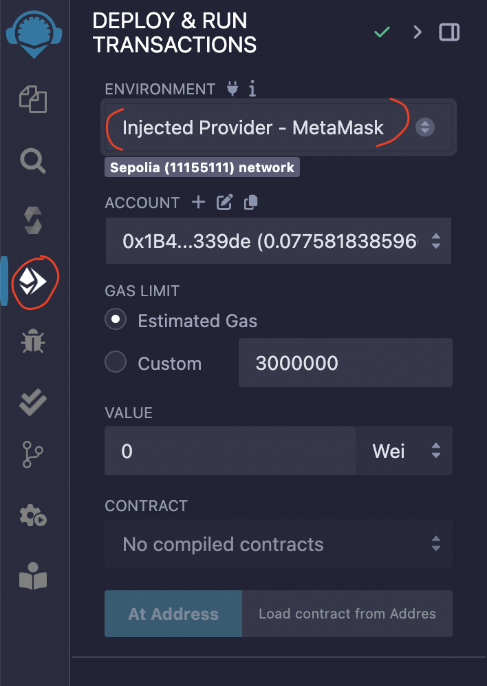
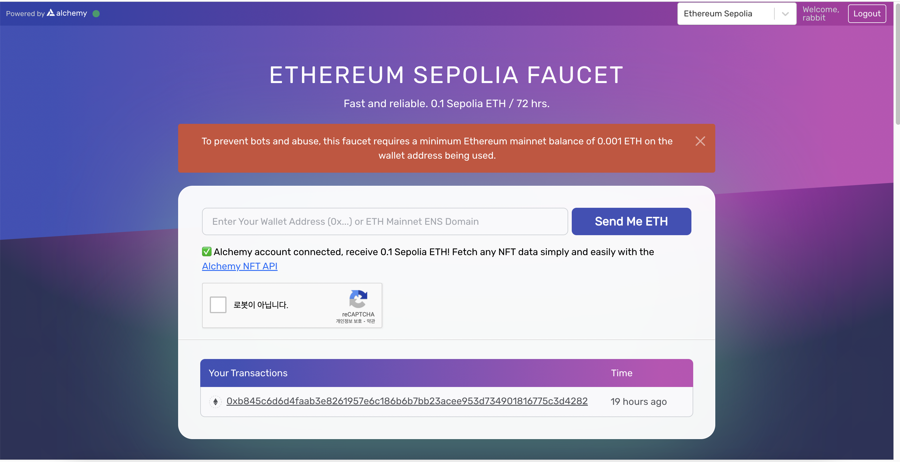

# 스마트 컨트랙트 이더리움 테스트넷(Sepolia) 배포

이 저장소는 Solidity 로 작성된 간단한 스마트 컨트랙트를 배포하는 방법에 대한 설명 페이지

Solidtiy 작성은 [Remix IDE](https://remix.ethereum.org/) 에서 작성할 것이고, Gas 비용은 이더리움 테스트넷(Sepolia) 을 통해 실습하는 방법으로 작성 됨

## [Remix IDE](https://remix.ethereum.org/) 에서 스마트 컨트랙트 작성

1. [Remix IDE](https://remix.ethereum.org/) 페이지로 이동

1. [contracts > MyToken.sol] 파일 열고, 아래 코드 저장. (ERC20 표준 사용)

    ```solidity
    // SPDX-License-Identifier: MIT
    pragma solidity ^0.8.20;

    import "@openzeppelin/contracts/token/ERC20/ERC20.sol";
    import "@openzeppelin/contracts/token/ERC20/extensions/ERC20Permit.sol";

    contract MyToken is ERC20, ERC20Permit {
        constructor() ERC20("MyToken", "MTK") ERC20Permit("MyToken") {}
    }

    contract TESTToken is ERC20("Test", "TST") {
        constructor(uint256 initialSupply) {
            _mint(msg.sender, initialSupply);
        }
    ```

    

1. 컴파일 실행 (컴파일 버전과, solidity 파일에서 작성된 버전 호환 여부 확인)

    

1. 배포 설정

    
    - 참고, metamask에서 이더리움 테스트넷 (예, Sepolia) 지갑의 ETH 확인
    - Gas 비 얻는 방법 :
    [faucet](https://www.alchemy.com/faucets/ethereum-sepolia) 과 같은 사이트에서 무료로 ETH 받기
    
1. 배포가 잘되었는지 확인 방법
- [Sepolia Testnet Explorer](https://sepolia.etherscan.io/) 에 방문하여, 출력된 Txn Hash, Block 으로 검색